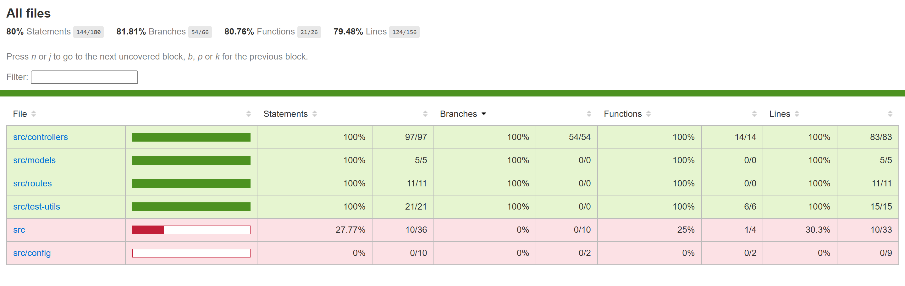

# 🍭 Sweet Shop API Backend

<div align="center">

[](https://incubyte.vinitborad.com)
[](#-test-coverage)
[](#-crafting-tools)
[](#-deployment)
[](#-crafting-tools)
[](#-crafting-tools)

**🎯 Checkout my craft at: [https://incubyte.vinitborad.com](https://incubyte.vinitborad.com)**

With this kata I would love to show you my startups: **[www.patrikaprinters.com](https://www.patrikaprinters.com)** (printed 2lakh+ pages of customers), **[www.hajripatrak.com](https://www.hajripatrak.com)** (Comprehensive QR attendance system for colleges/universities), **[www.apnipg.com](https://www.apnipg.com)** (Generated up to ₹1.25 lakhs of revenue, PG brokering Platform).

</div>

## 🚨 Clarifications

- I dont have used AI to code things, but I have used AI to learn things.
- I have created higly test converaged backend infrastrcutre. And i would love to follow same also on frontend as i had focued more here on creating funtional ui first due to time constraint.
- I would love to spend more time to craft more functionalities in this projects like Auth, Email/Push Notifications, Payment Gateway, Analytics, etc.

### 🔗 Complete Project Ecosystem
This is backend repo of our sweet shop:
- 🤖 **Chatbot**: Check out [incubyte-project-chatbot](https://github.com/vinitborad/incubyte-project-chatbot) to see our RAG based AI Agent built using LangGraph & OpenAI
- 🎨 **Frontend**: Check out [incubyte-project-frontend](https://github.com/vinitborad/incubyte-project-frontend) for frontend of sweet shop built using NextJS/React
- 🔧 **Backend**: This repository (Express.js API with MongoDB)

## ⚡ Crafting Tools

Crafted using TypeScript, Express, Python, FastAPI, Jest and Pytest for TDD, LangChain/LangGraph, OpenAI, React, NextJS, Docker, Containerization, VPS(DigitalOcean), GitHub Workflows:
- **Backend**: TypeScript, Express.js, Node.js
- **Database**: MongoDB with Mongoose ODM
- **Testing**: Jest, Supertest (TDD approach)
- **AI/ML**: LangChain, LangGraph, OpenAI APIs
- **DevOps**: Docker, Containerization
- **Deployment**: VPS (DigitalOcean), GitHub Workflows for Test Checking
- **Package Manager**: pnpm

## 📊 Test Coverage



This project follows **Test-Driven Development (TDD)** principles with comprehensive test coverage:
- ✅ **80%+ Test Coverage**
- 🔍 **Unit Tests** for all controllers
- 🌐 **Integration Tests** for API endpoints
- 🏃‍♂️ **Continuous Testing** with GitHub Actions

### 🧪 TDD Implementation Evidence
All features were implemented following the **Red-Green-Refactor** cycle:
1. ❌ **Red**: Write failing tests first
2. ✅ **Green**: Write minimal code to pass tests  
3. 🔄 **Refactor**: Improve code while keeping tests passing

### 📋 Latest Test Results
```bash
All files: 80% Statements (144/180), 81.81% Branches (54/66), 80.76% Functions (21/26), 79.48% Lines (124/156)

Coverage Breakdown by Directory:
├── src/controllers/     100% coverage (97/97 statements)
├── src/models/         100% coverage (5/5 statements)  
├── src/routes/         100% coverage (11/11 statements)
├── src/test-utils/     100% coverage (21/21 statements)
├── src/config/         0% coverage (0/10 statements)
└── src/                27.77% coverage (10/36 statements)
```

## 🛠️ Features

### Core Functionality
- 🍬 **Sweet Management**: Add, view, update, delete sweets
- 🔍 **Advanced Search**: Filter by name, category, price range
- 📦 **Inventory Management**: Purchase and restock operations
- 🏷️ **Category Management**: Dynamic category listing
- 📈 **Real-time Stock Updates**: Automatic quantity management
- 🤖 **AI Waiter Chatbot**: Natural language interaction for product details and direct purchases through our intelligent AI assistant

### API Endpoints

| Method | Endpoint | Description |
|--------|----------|-------------|
| `POST` | `/add` | Add a new sweet to inventory |
| `GET` | `/view-all` | Get all sweets |
| `DELETE` | `/delete/:id` | Remove sweet from inventory |
| `GET` | `/search` | Search sweets with filters |
| `POST` | `/purchase/:id` | Purchase sweet (reduce quantity) |
| `POST` | `/restock/:id` | Restock sweet (increase quantity) |
| `GET` | `/categories` | Get all unique categories |

## 🚀 Quick Start

### Prerequisites
- **Node.js** (v16 or higher)
- **MongoDB** (local or cloud)
- **pnpm** package manager

### Installation

1. **Clone the repository**
   ```bash
   git clone https://github.com/vinitborad/incubyte-project-backend.git
   cd incubyte-project-backend
   ```

2. **Install dependencies**
   ```bash
   pnpm install
   ```

3. **Set up environment variables**
   ```bash
   cp .env.example .env
   ```
   Update `.env` with your configuration:
   ```env
   PORT=5000
   MONGODB_URI=mongodb://127.0.0.1:27017/sweet-shop
   NODE_ENV=development
   ```

4. **Start the application**
   ```bash   
   # Production build
   pnpm build
   pnpm start
   ```

### 🧪 Running Tests

```bash
# Run all tests
pnpm test

# Run tests with coverage
pnpm test:coverage

# Watch mode for development
pnpm test --watch
```

## 🐳 Docker Deployment

This project includes a multi-stage Dockerfile for optimized production deployment:

```bash
# Build the image
docker build -t sweet-shop-backend .

# Run the container
docker run -p 5000:5000 --env-file .env sweet-shop-backend
```

### Multi-stage Build Benefits
- 📦 **Smaller Image Size**
- 🔒 **No dev dependencies in production**
- ⚡ **Fast Startup: Optimized for cloud deployment**

## 📁 Project Structure

```
backend/
├── src/
│   ├── config/
│   │   └── db.ts                 # Database configuration
│   ├── controllers/
│   │   ├── sweet.controller.ts   # Business logic
│   │   └── sweet.controller.test.ts # Controller tests
│   ├── models/
│   │   ├── sweet.model.ts        # Mongoose model
│   │   └── sweet.schema.ts       # Data schema & validation
│   ├── routes/
│   │   └── sweet.routes.ts       # API routes definition
│   ├── test-utils/
│   │   └── db-handler.ts         # Test database utilities
│   ├── app.ts                    # Express app configuration
│   ├── server.ts                 # Server entry point
│   └── check-env.ts              # Environment validation
├── coverage/                     # Test coverage reports
├── public/
│   └── test-coverage.png         # Coverage visualization
├── Dockerfile                    # Multi-stage production build
├── jest.config.js               # Jest testing configuration
├── tsconfig.json                # TypeScript configuration
└── README.md                    # You are here! 📍
```

## 🚢 Deployment

### VPS Deployment (DigitalOcean)
This application is deployed on a VPS with:
- 🐳 Docker containerization
- 🔄 GitHub Actions CI/CD
- 🌐 Nginx reverse proxy
- 🔒 SSL/TLS encryption

##  Future Enhancements

Given more time, I would love to extend this project with:
- 🔐 **Authentication & Authorization** (Role-based access)
- 📧 **Email Notifications** for low stock alerts
- 📊 **Analytics Dashboard** with sales insights
- 🛒 **Shopping Cart** functionality
- 💳 **Payment Integration** (Stripe/Razorpay)
- 📱 **Mobile App** with React Native
- 🔍 **Advanced Search** with Elasticsearch
- 📈 **Real-time Analytics** with WebSockets

## 🤝 Contributing

I welcome contributions to make this project even better! Here's how you can help:

### Development Setup
1. Fork the repository
2. Create a feature branch: `git checkout -b feature/amazing-feature`
3. Make your changes following the coding standards
4. Write tests for your changes
5. Ensure all tests pass: `pnpm test`
6. Commit your changes: `git commit -m 'Add amazing feature'`
7. Push to the branch: `git push origin feature/amazing-feature`
8. Open a Pull Request

### Coding Standards
- Follow existing TypeScript patterns
- Maintain good test coverage
- Use meaningful commit messages and comments in code
- Follow REST API conventions

## 🎉 Acknowledgments

**Big thanks to [Incubyte Consulting LLP](https://incubyte.co) to made me build this beautiful piece of software.**

## 👨‍💻 About the Developer

### 📬 Connect With Me

<div align="center">

[](https://www.linkedin.com/in/vinitborad)
[](https://github.com/vinitborad)
[](mailto:vinitboradofficial@gmail.com)

</div>

---

<div align="center">

**⭐ If you found this project helpful, please give it a star!**

*Built with ❤️ by [Vinit Borad](https://github.com/vinitborad) for [Incubyte](https://incubyte.co)*

**🎯 [View Live Demo](https://incubyte.vinitborad.com) | 🤖 [Try AI Chatbot](https://github.com/vinitborad/incubyte-project-chatbot) | 🎨 [See Frontend](https://github.com/vinitborad/incubyte-project-frontend)**

</div>
